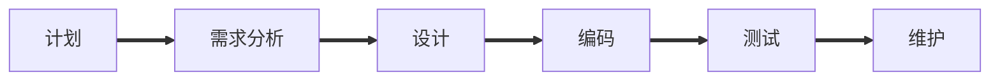

## 软件过程

按照项目进度,成本和质量要求,遵循用户需求,开发和维护软件,管理软件项目的一系列有序软件开发活动

特点:

- 并行性

## 瀑布模型[^1]

[^1]: 一种整体开发模型,按线性顺序进行

**开发过程**：

**生存周期三阶段**,每个阶段都可以分为更小的阶段

- 软件定义
- 运行及维护
- 软件开发

**特点**:

- 一组任务明确的开发活动

- 相邻活动间存在因果关系,前一个阶段不完成,后一个阶段不开始

- 每个活动结束后需要评审,坚持阶段评审原则

**优点**：

​		简单 容易理解掌握，应用和管理

**缺点**:

- 缺乏灵活性,不易于应对多变活不确定的用户需求
- 用户与开发者不易沟通
- 不适用可变需求

## 螺旋模型

结合了 **瀑布模型**和**增量模型** 加入了**风险分析**
开发过程制定为4类活动：

> - 制定计划
> - 风险分析
> - 实施工程
> - 客户评估

## 喷泉模型[^3]

[^3]: 一种面向对象模型

开发过程4个阶段:

>- 分析
>- 系统设计
>- 软件设计
>- 软件实现

各阶段相互重叠[^!]

[^!]: 并行性

## 原理模型[^4]

[^4]:  一种循环的模型

分为四步：

> - 快速分析
> - 构造原型
> - 运行和评价原型
> - 修改与改进

## 增量模型[^5]

[^5]: 一种非整体开发的模型

增量开发和增量提交

## 智能模型

