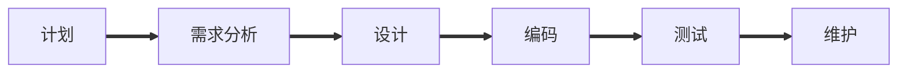

# Chapter 1

## 软件过程

按照项目进度,成本和质量要求,遵循用户需求,开发和维护软件,管理软件项目的一系列有序软件开发活动

特点:

- 并行性

## 瀑布模型[^1]

[^1]: 一种整体开发模型,按线性顺序进行

带有反馈环

**开发过程**：

**生存周期三阶段**,每个阶段都可以分为更小的阶段

- 软件定义
- 运行及维护
- 软件开发

**特点**:

- 阶段间具有顺序性和依赖性.
  必须等前一阶段的工作完成后才能开始后一阶段的工作.
  前一阶段的输出文档就是后一阶段的输入文档

- 推迟实现的观点
  尽可能推迟程序的物理实现

- 质量保证的观点
  每个阶段都要完成规定的文档,没交出合格的文档就是没有完成该阶段的任务
  每个阶段结束前都要对完成的文档进行评审,一边尽早发现问题,改正错误

**优点**：

​		强迫开发人员采用规范的方法,规定每个阶段必须提交文档,且产品必须经过质量保证小组的仔细验证.
​		基本上是一种文档驱动的模型

**缺点**:

- 缺乏灵活性,不易于应对多变活不确定的用户需求
- 用户与开发者不易沟通
- 不适用可变需求

适用于 熟悉的领域,不适合开发新的软件

## 快速原型模型

没有反馈环

**快速原型**:快速建立起来的可以在计算机上运行的程序. 功能往往是最终产品功能的一个子集

原型系统已经通过与用户交互而得到验证,后续阶段不会因为发现错误而进行较大的返工
开发人员通过建立原型系统已经了解了用户需求

适用于 陌生领域,在需求方面改进

## 增量模型

分阶段,效率高,风险低
又称为 渐增模型

增量模型 分批逐步向用户提交产品,整个软件被分解成多个增量构件,一件一件向用户提交产品.
优点:

- 可以在较短时间内向用户提交可完成部分工作的产品.
- 逐步增加功能使用户有充裕的时间学习和适应新产品.
- 有可能加快工程进度

缺点:

- 构件可能无法集成到一起

增量模型本身是自相矛盾的,一方面要求开发人员把软件看成一个整体,有要求把软件看构件序列,且每个构件本质上都独立于其他构件.

## 螺旋模型

结合了 **瀑布模型**和**增量模型** 加入了**风险分析**,适用于**大型内部软件**的设计 
构建原型是一种能使某些类型的风险降至最低的方法.
螺旋模型的基本思想:使用原型及其他方法来尽量降低风险
可以看作是每个阶段前都加了风险分析的快速原型模型

优点:

- 风险驱动
- 减少了过多测试或测试不足带来的风险

主要适用于内部开发的大规模软件项目

## 喷泉模型[^3] (迭代)

[^3]: 一种面向对象模型

典型的面向对象的软件过程之一

面向对象软件开发过程 具有 迭代 和 无缝 的特性
不同阶段存在交迭,分析、设计和编码等开发活动之间无缝过渡.

# Chapter 2

## 敏捷开发方法

传统方法的特点和不足:

- 遵循严格的过程和计划
- 以文档为中心
- 等到开发后期才有可运行软件

### 敏捷方法

- 一种轻量级软件开发方法
- 主张以代码为中心,快速应对需求变化,持续,及时交付可运行的软件系统
- 提供一组思想和策略 知道快速响应用户需求的变化

#### 思想

- 强化可运行的软件 弱化文档
- 以适应变化为目的推进开发
- 以人为本

#### 特点:

- 小 生成少量软件文件 文件规模小 每次迭代要实现的功能数量和规模小
- 简 技术 工具 每次迭代要解决的问题尽可能简单 只关注当前想实现的功能需求
- 快 快速响应变化
- 变 允许需求动态变化

### 具体的敏捷开发方法

#### 极限编程
思想:交流 反馈 简单 勇气
指导原则 快速反馈 简单性假设 逐步更改 支持变化 高量工作

#### 测试驱动开发方式
思想:开发程序代码之前 先确定和编写测试
特点:

- 根据测试来编写代码
- 确保任何程序代码都是可测试的
- 编码完成后即完工
- 易于维护,质量保证

## 群体化开发方法

闭源软件: 软件代码不对用户开放
无法获得源代码且无权使用源代码
无法掌握软件内部实现情况
无法修改和完善软件

开源软件: 源代码可以自由获取和传播
源代码对外开放
自由使用,修改和传播

## 面向对象的开发方法

基本思想: 对问题领域进行自然的分割,以更接近人类通常思维的方式建立问题领域的模型,对客观的信息实体进行结构和行为的模拟,从而使设计的软件更直接地表现问题的求解过程

以对象为最基本的元素,是分析和解决问题的核心

设计程序的基本机制:

- 继承
- 消息
- 方法

### 基本概念 

对象:

对象是对客观事或概念的抽象表述,不仅能表示具体的实例,也可以表示抽象的规则. 通以下类型:

- 有形的实体 飞机车辆房子....
- 作用 人或组织,教师学生医生等起的作用
- 事件  学习 演出 开会 办公..
- 性能说明  计算机的型号 速度 性能说明...

类:

类又称对象类 是一组具有相同数据结构和相同操作的对象的集合.类是对象的模板,每个对象都是类的实例
都可以使用类中的函数

对象是类的实力,因此分析和设计时,注意力应该集中在类上,而不是具体的对象上

继承:

以现存的定义为基础,建立新定义的技术,是父类和子类共享数据结构和方法的机制
子类继承了父类的特性,子类的公共属性和操作归属于父类

建立继承关系采用的方式有:

- 从顶向下
- 从底向上

消息:

对象之间在交互中所传送的通信消息

### 面向对象开发的组成

OOSD 由 OOA(面向对象的分析) OOD(面向对象的设计) OOP(面向对象的程序设计) 三部分组成
Analysis Design Project

OOA 解决做什么的问题,任务就是建立以下三种模型

1. 对象模型(信息模型) 定义系统的类和对象,它们的属性与操作
2. 状态模型(动态模型) 描述任何时刻对象的联系及其改变
3. 处理模型(函数模型) 描述系统内部数据的传送处理

OOD 

在分析的基础上解决如何做的问题

OOA 和 OOD  是面向对象开发的关键

Coad方法中面向对象的分析模型的层次有 主题层和对象层

面向对象的要素 抽象 继承 封装

## 结构化分析

#### 三个要点:

- 采用自顶向下功能分解的方法
- 强调逻辑功能而不是实现功能的具体方法
- 使用图形进行系统分析并表达分析结果

#### 可行性研究的目的

用最小的代价在尽可能短的时间内研究并确定客户的问题是否有解决方法.

1. 技术可行性
2. 经济可行性
3. 操作可行性

#### 需求分析的任务

1. 确定对系统的综合要求
2. 分析系统的数据要求
3. 导出系统的逻辑模型
4. 修正系统开发计划

#### 与用户沟通的方法:

1. 访谈
2. 面向数据流自顶向下求精
3. 简易的应用规格说明技术
4. 快速建立软件原型

#### 实体-联系图
为了描述用户数据,系统分析员建立数据模型.通常使用**实体-联系图(E-R图)**来建立数据模型**(E-R模型)**
E-R图中包含了 **实体,关系和属性** 三种基本成分

#### 数据流图

数据流图描绘数据在软件系统内从输入到输出中所经受的变换,是系统逻辑功能的图形表示

- 正方形 表示数据的源点或终点
- 圆角矩形 代表数据的处理
- 开口矩形(两条平行线) 代表数据存储
- 箭头线 表示数据流 即数据的流动方向

数据存储和数据流都是数据,仅仅状态不同 数据存储是静态的数据 而数据流是运动状态的数据

#### 数据字典

数据字典是关于数据的信息的集合
数据字典和数据流图共同构成系统的逻辑模型
数据字典定义数据的方法就是对数据自顶向下地分解,当分解到不需要进一步定义,都明白其含义时结束

- = 等价于 (或 定义为)
- \+ 和 (顺序连接两个分量)
- \[ ] 或 (从括号里若干分量选择一个)
- { } 重复 (重复括号里的分量)
- ( ) 可选 (括号里的分量可有可无)

#### 状态转换图

简称状态图 描绘系统状态以及引起系统状态转换的时间来表示系统的行为

状态

可以被观察到的系统行为模式 一个状态代表系统的一种行为模式
有 初态,终态 和中间状态 一张状态图只有一个初态 终态>=0
实心圆表示初态 同心圆表示终态 圆角矩形表示 中间状态

事件

某个时刻发生的事件

状态图中两个状态之间带箭头的连线称为状态转换,箭头指明方向.状态转换通常由时事件触发.

## 数据字典

组成

- 数据流
- 数据流分量(数据元素)
- 数据存储
- 处理

数据元素的别名就是其其他等价名字

由数据元素组成数据的方式只有三种基本类型

- 顺序 以确定次序连接两个或多个变量
- 选择 从两个或多个元素中选取一个
- 重复 把指定的分量重复零次或多次

上下限角标表示重复的可能次数 相等时表示重复固定次数

~1~^5^{A} 和 1{A}5 含义相同

数据的符号的使用方法:标识符
标识符是长度不超过八个字符的字符串 第一个字符必须是字母字符

标识符=字母+字母数字串
字母数字串=0(字母或数字)7
字母或数字=[字母字符|数字字符]

## 数据流程图

符号:

例子

